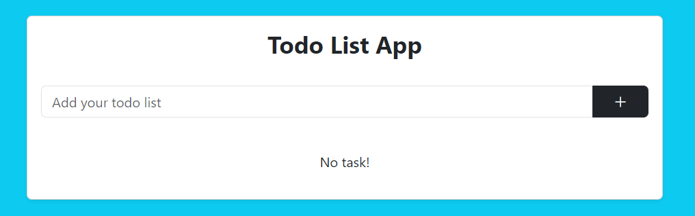
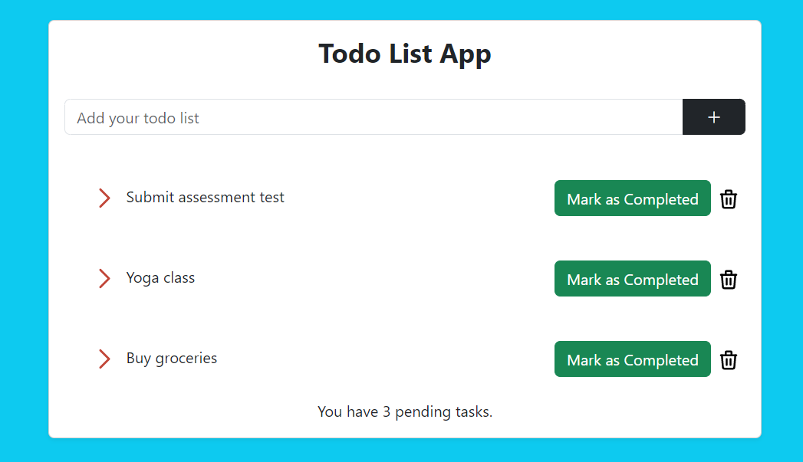
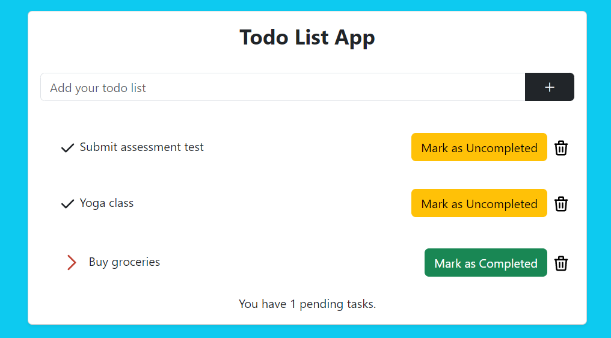
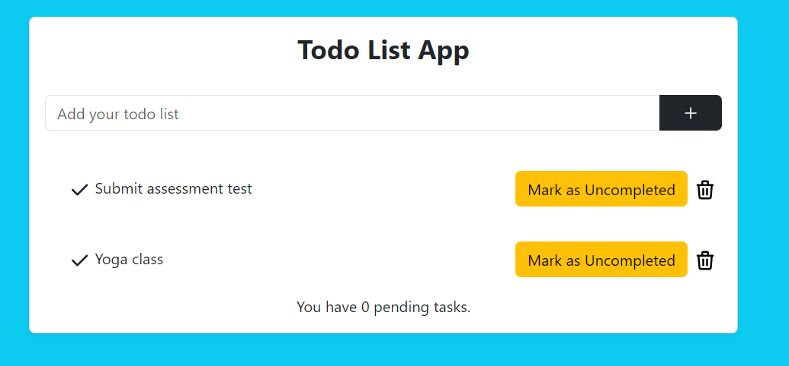

## Laravel Todo App

This is simple to do app. 
Built on Laravel Framework 9.48.0 and PHP 8.2.1.

Functions:
1. Add todolist
2. Delete todolist
3. Mark as Completed/Uncompleted
4. Count pending task

## Installation

Clone the repository- (or download zip file if not working)
```
git clone https://github.com/tengkumimi/Todoapp.git
```

Then cd into the folder with this command-
```
cd todoapp
```

Then do a composer install
```
composer install
```

Then create a environment file using this command-
```
cp .env.example .env
```

Then edit `.env` file with appropriate credential for your database server. Just edit these two parameter(`DB_USERNAME`, `DB_PASSWORD`).

Then create a database named `todolist` and then do a database migration using this command-
```
php artisan migrate
```

Then change permission of storage folder using thins command-
```
(sudo) chmod 777 -R storage
```

At last generate application key, which will be used for password hashing, session and cookie encryption etc.
```
php artisan key:generate
```

## Run server

Run server using this command-
```
php artisan serve
```

Then go to `http://localhost:8000` from your browser and see the app.

No task:


With task:


Completed task:


Delete task:


